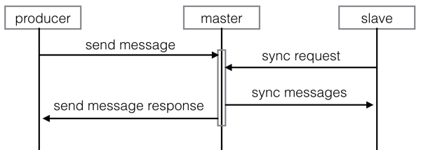

[上一页](code.md)
[回目录](../../readme.md)
[下一页](monitor.md)

# 高可用(HA)

QMQ分别从两个角度提供高可用能力：分片和复制

首先因为QMQ不是基于partition的，所以很容易通过添加更多的机器就能提高一个subject的可用性，消息按照一定的负载均衡策略分布在不同的机器上，某台机器离线后producer将不再将消息发送给该Server。

除此之外，QMQ通过主从复制来提高单机可用性。QMQ将服务端集群划分为多个group，每个group包含一个master和一个slave。消息的发送和消费全部指向master，slave只为保证可用性。

当消息发送给master后，slave会从master同步消息，只有消息同步到slave后master才会返回成功的响应给producer，这就保证了master和slave上都有一致的消息。当master和slave之间的延迟增大时，会标记该group为readonly状态，这个时候将不再接收消息，只提供消息消费服务。下图为消息发送和主从同步示意图:

目前当master离线后，不提供自动切换功能，需要人工启动master。当slave离线后，该group不再提供接收消息服务，只提供消息消费服务。当master出现故障，导致消息丢失时，可以将其切换为slave，原来的slave切换为master，slave将从master同步数据，同步完成后提供服务。

[上一页](code.md)
[回目录](../../readme.md)
[下一页](monitor.md)
